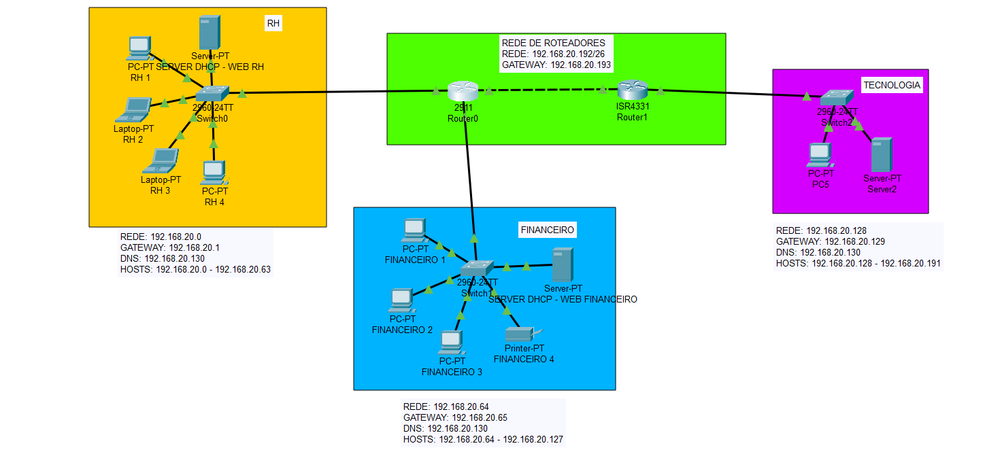

# Network-ADA-Project

Repositório direcionado para o projeto final do curso de redes do módulo de Redes da ADA Tech.

O projeto consiste na configuração de uma rede que contenha 4 subredes baseados no IP 192.168.20.0, a partir dele conseguiremos segmentar as redes:
1. 192.168.20.0/26
2. 192.168.20.64/26
3. 192.168.20.128/26
4. 192.168.20.192/26

Todas sob a máscara 255.255.255.192.

De acordo com o exercício proposto criaremos 3 redes:
Rede Financeira
3x Computadores/Notebooks
1x Impressora
1x Servidor DHCP

Rede Recursos Humanos
4x Computadores/Notebooks
1x Servidor DHCP

Rede Tecnologia
1x Computador/Notebook
1x Servidor DHCP/DNS

A partir desta lógica construíremos da seguinte forma:
1. Estruturaremos um intervalo de IP's para o setor recursos humanos 192.168.20.0 até o 192.168.20.63
2. Configuraremos o servidor do financeiro para que ele consiga estruturas esses endereços através do DHCP nas máquinas
3. Conectamos todos os dispostivios da rede financeira através do cabo de cobre
4. Estruturaremos um intervalo de IP's para o setor financeiro 192.168.20.64 até o 192.168.20.127
5. Configuraremos o servidor do financeiro para que ele consiga estruturas esses endereços através do DHCP nas máquinas
6. Conectamos todos os dispostivios da rede financeira através do cabo de cobre
7. Vamos conectar os switches a um roteador específico 2911 e configurar as rotas
8. Por fim segmentar uma rede para o setor de tecnologia que será de 192.168.20.128 até 192.168.20.191
9. Configuraremos o DNS do servidor de tecnologia para que ele resolva o do setor financeiro e de recursos humanos
10. Ligamos tudo aos roteadores e usaremos a seguinte lógica de comunicação:

Os roteadores precisam ter as rotas das redes em que estão dispostas, nesse caso 192.168.20.0, 192.168.20.64 e 192.168.128. Enquanto que na interface que ligam as duas redes nós configuraremos um endereço a parte onde os roteadores irão se comunicar, no projeto disposto foram utilizadas as rotas 192.168.20.194 e 192.168.20.195 para que eles consigam se comunicar. A partir daqui conseguimos configurar a rota estática que deve sempre seguir o padrão de: Endereço da rede, máscara de rede e endereço do roteador da rede que deseja acessar.
OBS: O mesmo precisa ser feito nos dois roteadores para que eles consigam se comunicar tanto na ida quanto na volta.

Imagem do projeto final:

